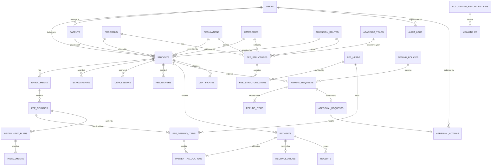

# Agent 40 — Database Schema & Data Flow Specification

## 1. Entity Relationship (ER) Diagram

## 2. Table Specifications

### Identity & Academic Foundation
- **`users`**: Core auth table with email, password hash, role (`STUDENT`, `PARENT`, `ACCOUNTS_OFFICER`, `ADMIN`, `MANAGEMENT`, `FINANCE_APPROVER`, `SYSTEM_ADMIN`), status.
- **`students`**: Institutional identity, Roll Number (unique), user link, parent link, program, regulation, category, admission route, admission year.
- **`parents`**: Guardian details and relationships with student records.
- **`programs`**, **`regulations`**, **`categories`**, **`academic_years`**, **`admission_routes`**, **`fee_heads`**: Master lookup tables.

### Fee Master & Versioning
- **`fee_structures`**: Header containing Program ID, Academic Year ID, Regulation ID, Category ID, Admission Route ID, Version (e.g. "v1", "v2"), Effective Dates, Status (`DRAFT`, `ACTIVE`, `SUPERSEDED`, `ARCHIVED`).
- **`fee_structure_items`**: Fee breakdown per fee head (Tuition, Examination, Hostel, Laboratory, etc.) with priority weight and refundable flags.

### Financial Demands & Waivers
- **`fee_demands`**: Master ledger per student per academic cycle with Gross Demand, Scholarship Amount, Concession Amount, Waiver Amount, Net Demand, Paid Amount, and Outstanding Amount.
- **`fee_demand_items`**: Per-head breakdown linking to specific fee structure version items.
- **`scholarships`**, **`concessions`**, **`fee_waivers`**: Explicit grants with grant authority and reference numbers.
- **`installment_plans`**, **`installments`**: Installment schedules with due dates, penalty amounts, and fulfillment status.

### Payment & Allocation
- **`payments`**: Payment records across `ONLINE_GATEWAY`, `BANK_TRANSFER`, `COUNTER` with UTR/Transaction numbers, payment status (`PENDING`, `RECEIVED`, `RECONCILED`, `PARTIALLY_RECONCILED`, `MISMATCH`, `FAILED`, `CANCELLED`).
- **`payment_allocations`**: Explicit line-item credit linking each payment to specific fee demand heads according to priority.
- **`reconciliations`**: Bank statement reconciliation linkage.

### Refunds & Approvals
- **`refund_policies`**: Date-based percentage deduction tiers and non-refundable fee head lists.
- **`refund_requests`**, **`refund_items`**: Student withdrawal refund workflows with state machines (`DRAFT`, `PENDING_APPROVAL`, `APPROVED`, `REJECTED`, `PROCESSED`).
- **`approval_requests`**, **`approval_actions`**: Two-man-rule approvals for refunds, balance adjustments, and waivers.

### Reconciliation & Audit
- **`accounting_reconciliations`**, **`mismatches`**: Ledger variance detection (`AMOUNT_MISMATCH`, `MISSING_TRANSACTION`, `DUPLICATE_TRANSACTION`, `WRONG_STUDENT`, `WRONG_FEE_HEAD`, `DATE_MISMATCH`).
- **`audit_logs`**: Append-only log of every financial query and mutation.
